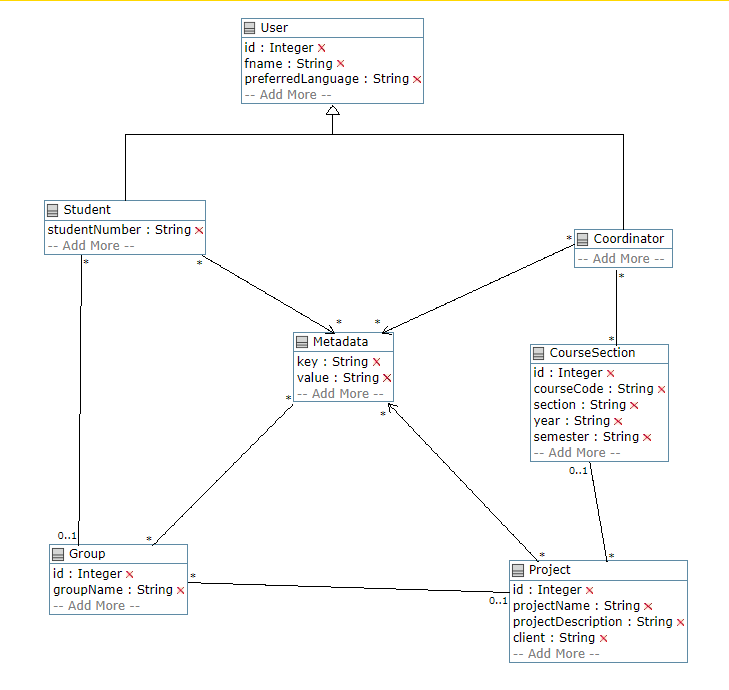
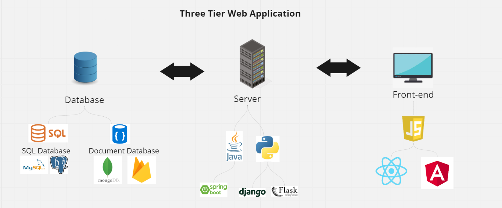
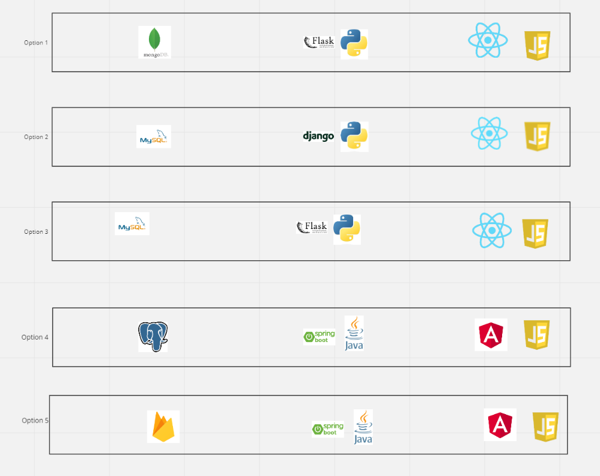
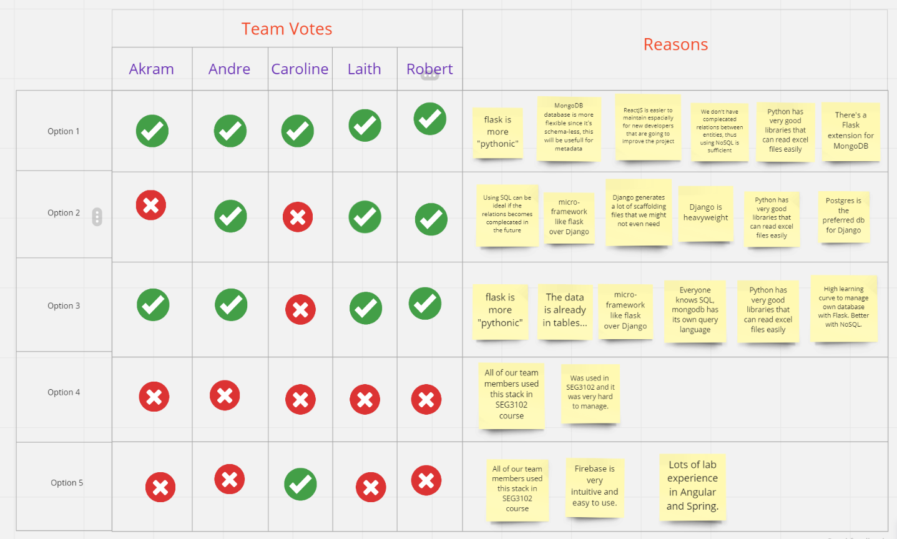

# Design

Last Update: 1/19/2023

## UML Class Diagram

- The UML diagram of the application is consisted of 4 main classes: User, Group, Project, CourseSection.
- The User class is a generalization for Student and Coordinator(Professor).
- The Metadata class holds new data categories that is manually inserted by the Coordinator in the Student, Group, and Project classes.
- The UMPLE code can be found [here](https://cruise.umple.org/umpleonline/umple.php?model=230113sak5joa7booi).

## Architecture Alternatives

### Full-Stack Application Technologies Chosen

### Technologies Options

### Team Votes for The Options

Based on the team votes, the first option was selected, which includes the following technologies:

- Front-end: JavaScript with ReactJS framework
- Back-end: Python with Flask framework
- Database: MongoDB

The Miro board link for the technologies alternatives can be found [here](https://miro.com/app/board/uXjVPyQl_eM=/).