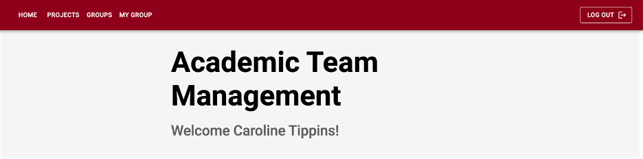
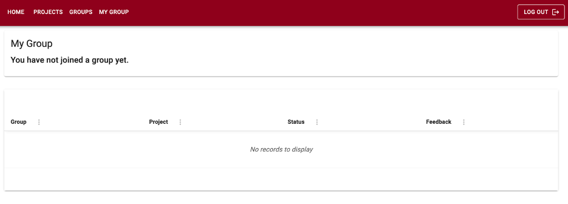

## Internationalization Feature

## Problem

Our application, the Academic Team Management, is within the Umple organization managed by Professor Timothy Lethbridge at uOttawa. The application will help professors and students form capstone and honours projects. The application is being developed within SEG 4911 and SEG 4910 (Software Engineering Capstone Project). Professors use the application to advertise projects, and students to form groups as well as join projects.

The problem is that since it is used within the University of Ottawa, the application needs to be in both official languages, French and English. Currently, our application is only written in English. Therefore, for the application to be usable by all students at the university, we need to add internationalization.

## Appetite

This feature will be a Big Batch, which will require six weeks. The scope of this feature will include setting up the internationalization, converting the hard-coded strings in the application to string variables and finally adding a UI component to transition from one language to the other easily. The application has a professor and student view with different sections with text that each needs to be internationalized. Many pages have tables and modals, as shown in the figures below. All the elements would need to be translated.

We propose dedicating six weeks to this project, involving a team of 2 developers and one designer. The goal is to create a fully functional bilingual app (English and French) that is culturally sensitive and resonates with our target audience. Therefore, from a high-level overview, we can outline the work being done in six weeks. During the first week, the team extensively researched and designed the UI elements. The components needed to translate the app will be developed during the second week. During the third week, the professor's view would be translated. During the fourth week, the translation of the student view would be done. The app will be tested during the fifth week to integrate the language functionality and UI adjustments. Any bugs found during the testing will be fixed during the sixth week.

## Solution

The solution is implementing a solid internationalization (i18n) feature within our Academic Team Management web application. This approach entails translating all string elements in our application, from buttons and menus to error messages and notifications, to be offered in English and French. As there are cultural and direct translation differences, we will incorporate region-specific nuances, aligning our app with our French-speaking users' linguistic and cultural expectations.

### Fat Markers

The fat marker sketches below show two alternative views of the UI with internationalization. Figure 4 shows a fat marker sketch with the application navigation bar with a dropdown element with the option to select the language. While this is a good idea, it might need to be more intuitive for users as they must understand that the dropdown menu is for selecting languages. Thus, an alternative view is provided (see Figure 5). This fat marker sketch has a button instead of a dropdown that allows the user to toggle from French to English. This is a convenient and straightforward way to implement an option to switch languages.

### Breadboards

Figure 6 shows a breadboard outlining the components and connections involved in our feature. The user will navigate to the welcome page, act on a language field, and then navigate to the language selection menu to select English or French as the application language. 

## Rabbit holes

There are many differences between English and French. Therefore, when translating the strings used in our application, many discussions and debates can occur to choose the right words. We must be careful to spend only a little time nitpicking word choice. Integrating a language switcher requires UI research and design to guarantee effortless user interaction. There are different ways to implement it (e.g., using a toggle or a drop-down list). Constant communication between developers, designers, and localization experts is necessary to ensure the unified integration of bilingual functionality.

## No-gos

Some more complex features, such as speech-specific translations and voice recognition for language selection, are outside the project scope. We also will not expand the scope of the languages used in the application. We are limiting it to French and English. These additional elements would be valuable and very interesting but implementing them would require a lot of research and resources. Therefore, they are unfeasible within our current time constraints.